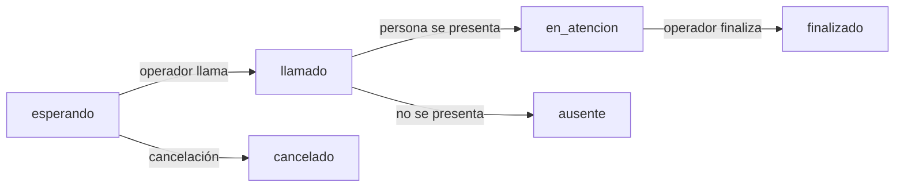

# Estados del turno

## Estados canónicos V1

- `esperando`
- `llamado`
- `en_atencion`
- `finalizado`
- `cancelado`
- `ausente`

## Máquina de estados

## Reglas

- Un turno nuevo comienza en `esperando`.
- `llamado` y `en_atencion` ocupan un box.
- `finalizado`, `cancelado` y `ausente` son estados terminales en V1.
- Un `rellamado` no es un estado: es un evento sobre un turno `llamado`.
- No se permite `esperando → finalizado` de forma directa.
- Al finalizar una jornada, un `esperando` histórico puede cerrarse como `cancelado` y un `llamado` histórico como `ausente`.
- Un `en_atencion` histórico no se cierra automáticamente: pasa a revisión humana.

## Auditoría esperada

Eventos mínimos: `created`, `called`, `recalled`, `started`, `transferred`, `finished`, `cancelled`, `absent`, `auto_expired`.

Relacionado: [[Jornada]], [[Boxes]], [[Flujo del ingresante]].